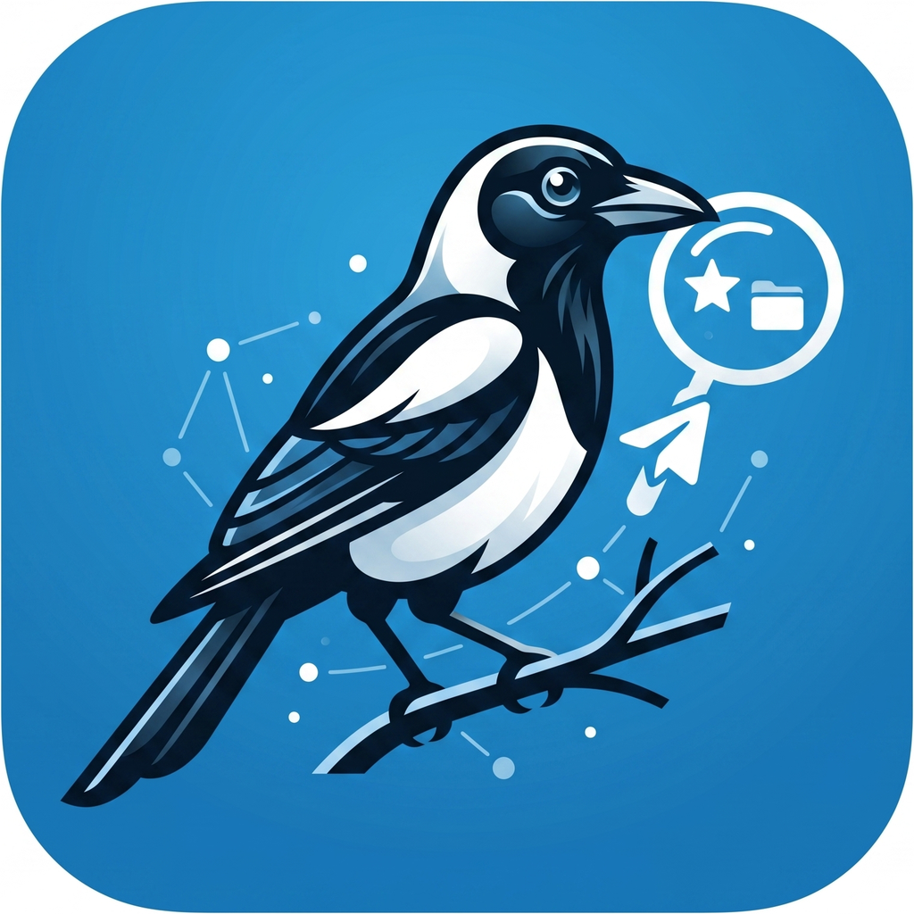

<h1 align="center">Soroka</h1>

<p align="center">
  
</p>

<p align="center">
  Telegram-бот, который превращает «Избранное» в персональную базу знаний.<br>
  Форвардишь в приватный канал — ищешь у бота в DM. Возвращает оригиналы, не пересказы.
</p>

<p align="center">
  <a href="https://github.com/AndyShaman/soroka/blob/main/LICENSE"></a>
  
  
  
  <a href="https://github.com/AndyShaman/soroka/stargazers"></a>
</p>

<p align="center">
  <a href="https://t.me/AI_Handler"></a>
  &nbsp;
  <a href="https://www.youtube.com/channel/UCLkP6wuW_P2hnagdaZMBtCw"></a>
</p>

---

## Как ставить

- 👤 **Сам, руками** — читай этот README по порядку: подготовка VPS → установка → настройка в Telegram.
- 🤖 **Через AI-агента** (Claude Code, Cursor и т.п.) — открой [AGENTS.md](AGENTS.md). Там протокол под автоматизацию: какие три значения спросить у пользователя, как запустить установщик через SSH, как проверить успех.

## Что нужно

1. **VPS** — Ubuntu 22.04+, 1 GB RAM. Заходишь как угодно: пароль, ключ,
   web-консоль панели хостера — без разницы.
2. **Telegram-бот** — создай у [@BotFather](https://t.me/BotFather), сохрани токен.
3. **Свой Telegram-ID** — узнай у [@userinfobot](https://t.me/userinfobot).

После установки бот сам спросит ключи (бесплатные/дешёвые):
- [Jina](https://jina.ai/embeddings) — эмбеддинги (free tier 1M токенов)
- [Deepgram](https://deepgram.com) — голос → текст ($200 free)
- [OpenRouter](https://openrouter.ai/keys) — LLM (есть `:free` модели)
- [GitHub Personal Access Token](https://github.com/settings/tokens/new) — для бэкапов

## Подготовка VPS (опционально)

Купил VPS, есть только IP + root + пароль? Я опубликовал отдельный скилл
для безопасной первичной настройки сервера: создаст non-root юзера, сгенерит
SSH-ключ, поднимет firewall и **заблокирует root + парольный SSH в самом
конце** — только после того, как новый ключ проверенно работает с твоего
ноута. Lockout-by-typo структурно невозможен.

**1. Поставь скилл** (один раз, на свой ноут):

```bash
curl -fsSL https://raw.githubusercontent.com/AndyShaman/vps-setup-skill/main/install.sh | bash
```

**2. Открой Claude Code и опиши задачу человеческими словами:**

> Купил VPS, вот письмо хостера, защити сервер.

Скилл проведёт через 14 шагов: от welcome-email до hardened production-ready
сервера. Подробности — [README скилла](https://github.com/AndyShaman/vps-setup-skill).

После этого возвращайся сюда и продолжай установкой.

## Установка

Зайди на VPS любым удобным способом и выполни прямо там:

```bash
git clone https://github.com/AndyShaman/soroka.git
cd soroka
./bin/install
```

Скрипт спросит **две вещи**: токен бота и твой Telegram-ID. Поставит Docker
(если ещё нет), запустит контейнер `soroka-bot` и пропишет `soroka-mcp` в
`/usr/local/bin/`. Никакого `rsync`, `--vps`, `ssh-copy-id` — всё работает
прямо там, где ты сейчас сидишь.

После завершения открой Telegram, найди своего бота и отправь `/start` —
мастер проведёт через 6 шагов настройки в чате.

## Команды бота

- `/start` — мастер настройки (запускается один раз; повтор возобновляет с прерванного шага)
- `/help` — справка
- `/status` — текущие настройки и статистика
- `/setjina`, `/setdeepgram`, `/setkey` — заменить отдельный ключ
- `/models` — выбрать основную/fallback LLM
- `/setgithub` — заменить GitHub-токен и репо-зеркало
- `/setvps` — задать IP/юзера VPS (используется в `/mcp`)
- `/setinbox` — сменить канал-инбокс
- `/export` — выгрузить базу архивом
- `/mcp` — конфиг для Claude Desktop (MCP-сервер по SSH stdio)
- `/cancel` — прервать мастер/диалог

## Архитектура

```
Канал «Избранное 2» ──→ Бот на VPS ──→ SQLite (FTS5 + sqlite-vec)
DM с ботом         ──↗               ↑
                                      │
Claude Desktop через MCP-stdio ──SSH──┘
```

## Обновление

Зайди на VPS, перейди в папку с репо и выполни:

```bash
cd ~/soroka     # или туда, куда ты делал git clone
./bin/update
```

Подтянет последний код через `git pull`, пересоберёт контейнер, обновит
`soroka-mcp`. Никаких аргументов.

## Резервное копирование

`/export` собирает базу + вложения в zip:

- **≤ 50 MB** — приходит прямо в Telegram.
- **> 50 MB** — без GitHub-зеркала: бот пришлёт «облегчённый» архив (только база) и
  попросит включить зеркало через `/setgithub`. С зеркалом: заливает полный архив
  GitHub Release в твой приватный репо и пришлёт ссылку плюс облегчённый локально.

## Для AI-агентов

См. `AGENTS.md` — там точный протокол развёртывания через флаги.

## Лицензия

MIT.
